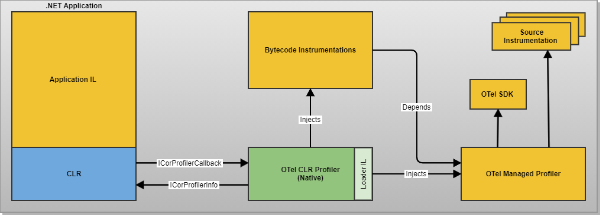

# Design

## Vision

These are the high-level goals defining the long-term vision for the project that will guide daily activities, its design, and feature acceptance.

- **High performance**: auto-instrumentation performance impact should not be a concern for its users.
- **Reliability**: stable and performant under different loads. Well-behaved under extreme load, with predictable, low resource consumption.
- **Visibility**: users should be able to generate telemetry data that provides deep and detailed visibility into their applications. Such telemetry must allow users to identify and solve application-related issues in production.
- **Useful out-of-the-box**: after install users should be able to get telemetry data from targeted libraries with none or minimal configuration (good selection of defaults).
- **Extensible**: key components can be chosen via configuration and plugins.

## Supported and Non-Supported Scenarios

Supported Scenarios:

- **Zero-touch source code instrummentation**: applications can be instrumented without source code changes,
although build changes may be required via the addition of specific NuGet packages.
- **Custom SDK support**: the instrumentation can initialize the OpenTelemetry .NET SDK, but
what OpenTelemetry SDK implementation is used and its initialization can also be delegated
to the application code.

Non-Supported Scenarios:

- **Applications using Ahead of Time (AOT) compilation**: the current implementation relies on the
[CLR Profiler APIs](https://docs.microsoft.com/en-us/dotnet/framework/unmanaged-api/profiling/)
and as such doesn't support AOT.
- **Side by side usage with other CLR Profiler based tools**: various tools for .NET
are also implemented using a CLR Profiler, however, only a single CLR Profiler can be used when running
the application.

## Error Handling

An initialization error, usually caused by invalid configuration, is logged and crashes the application.

Any errors occurring at application run-time are logged and should never crash the application.

## Architecture

To instrument a .NET application without requiring source code changes, the OpenTelemetry .NET Instrumentation uses the
[CLR Profiler APIs](https://docs.microsoft.com/en-us/dotnet/framework/unmanaged-api/profiling/)
to bootstrap the [OpenTelemetry .NET SDK](https://github.com/open-telemetry/opentelemetry-dotnet#readme)
and inject the selected instrumentations into the targeted application.

The main components of the project are:

- [**CLR Profiler Dll**](../src/OpenTelemetry.AutoInstrumentation.Native):
a native component that implements a CLR Profiler. The CLR Profiler is used to
modify the application [IL](https://en.wikipedia.org/wiki/Common_Intermediate_Language),
including the IL of packages used by the application, to add and collect observability data.

- [**Loader**](../src/OpenTelemetry.AutoInstrumentation.Loader):
a tiny managed library shipped as a resource of the native CLR Profiler.
Its code is in charge of loading the bootstrap code into the targeted application and extend the assembly
load paths to include the folders with the OpenTelemetry .NET SDK and the instrumentations to be
injected into the application.

- [**Managed Profiler**](../src/OpenTelemetry.AutoInstrumentation):
contains the code setting up the OpenTelemtry .NET SDK and configured instrumentations.
Plus, support code to run and implement bytecode instrumentations. Optionally, the code
setting-up the OpenTelemetry .NET SDK can be left to the application by setting the
environment variable `OTEL_DOTNET_AUTO_LOAD_AT_STARTUP` to `false`.

- **Source Instrumentations**: instrumentations created on top of API hooks/callbacks provided
directly by the library/framework being instrumented. This type of instrumentation depends on the
OpenTelemetry API and the specific library/framework that they instrument. Some examples:

  - [ASP.NET Core Instrumentation](https://github.com/open-telemetry/opentelemetry-dotnet/tree/main/src/OpenTelemetry.Instrumentation.AspNetCore)
  - [gRPC Client Instrumentation](https://github.com/open-telemetry/opentelemetry-dotnet/tree/main/src/OpenTelemetry.Instrumentation.GrpcNetClient)
  - [HttpClient and HttpWebRequest Instrumentation](https://github.com/open-telemetry/opentelemetry-dotnet/tree/main/src/OpenTelemetry.Instrumentation.Http)

- **Bytecode Instrumentations**: instrumentations created for libraries/frameworks that lack proper
hooks/callbacks to allow implementation of good observability data. These instrumentations must be
implemented following the proper attribute annotation so the native CLR Profiler implementation
can properly inject them at runtime. Some examples:

  - [MongoDB Instrumentation](../src/OpenTelemetry.AutoInstrumentation/Instrumentations/MongoDB)
  - [GraphQL](../src/OpenTelemetry.AutoInstrumentation/Instrumentations/GraphQL)

### Injecting the OpenTelemetry .NET SDK and Instrumentations

The OpenTelemetry .NET SDK and selected source instrumentations are injected into the targeted process
via a series of steps started by the CLR Profiler Dll:

1. On the [CorProfiler::ModuleLoadFinished](https://docs.microsoft.com/en-us/dotnet/framework/unmanaged-api/profiling/icorprofilercallback-moduleloadfinished-method)
callback the CLR Profiler Dll takes the following actions:

  - If the loaded module is in the set of modules for which there is bytecode instrumentation,
  or if it is the first non-corelib module (not in one of the special cases), add the module to a
  map of modules "to be instrumented".
  - If there is bytecode instrumentation for the module, request a JIT recompilation via
  [ICorProfilerInfo::RequestReJIT](https://docs.microsoft.com/en-us/dotnet/framework/unmanaged-api/profiling/icorprofilerinfo4-requestrejit-method)
  for the methods targeted by the bytecode instrumentation.

2. On the [CorProfiler::JITCompilationStarted](https://docs.microsoft.com/en-us/dotnet/framework/unmanaged-api/profiling/icorprofilercallback-jitcompilationstarted-method)
callback the CLR Profiler Dll proceeds in the following steps:

  - If this is the first module to be instrumented in the current AppDomain, inject the IL calling the
  Loader `Startup` type constructor. This type of constructor will:
    * Add an event handler to the
    [`AssemblyResolve`](https://docs.microsoft.com/en-us/dotnet/api/system.appdomain.assemblyresolve?view=net-5.0)
    so it can add any assembly needed by the SDK itself or any instrumentation.
    * Run, via reflection, the `Initialization` method from the Managed Profiler assembly.
      - The `Initialization` code will bootstrap the OpenTelemetry .NET SDK (adding configured processors, exporters, etc.)
  and will also initialize any configured source instrumentations.
  - If the first method observed by JITCompilationStarted is IIS startup code, invoke
    AppDomain.CurrentDomain.SetData("OpenTelemetry_IISPreInitStart", true) so automatic instrumentation correctly
    handles IIS startup scenarios

### Bytecode Instrumentations

The bytecode instrumentation (referred to as "call target" in this repo) relies on the JIT recompilation 
capability of the CLR to rewrite the IL for instrumented methods. This adds logic at
the beginning and end of the instrumented methods to invoke instrumentation written in this repo and
wraps the calls with try-catch blocks to prevent instrumentation errors from affecting the normal operation
of the application.

Bytecode instrumentation methods should not have direct dependencies with the libraries that they instrument.
This way, they can work with multiple versions of the assemblies being targeted for instrumentation
and reduce the number of shipped files. 
When operating with parameters and return values of the targeted methods, the instrumentation methods must use
[DuckTyping](../src/OpenTelemetry.AutoInstrumentation.Managed/DuckTyping/README.md) or
[reflection](https://docs.microsoft.com/en-us/dotnet/framework/reflection-and-codedom/reflection)
to access objects from the APIs being instrumented.

### Assembly Conflict Resolution

The injection of the OpenTelemetry .NET SDK and any source instrumentation brings
the risk of assembly version conflicts.
This issue is more likely with the [NuGet package System.Diagnostic.DiagnosticSource](https://www.nuget.org/packages/System.Diagnostics.DiagnosticSource/)
and its dependencies since it contains the [Activity type](https://docs.microsoft.com/en-us/dotnet/api/system.diagnostics.activity?view=net-5.0)
used by the OpenTelemetry .NET API to represent a span.
This package, previously released by Microsoft, is already used by various applications.
Two issues can arise from incorrect versioning:

1. Version required by the OpenTelemetry .NET SDK or the instrumentations not being met.
2. Multiple versions of the assembly in the same process since these are treated as totally independent by the runtime.

#### Build Time Resolution

Currently, the path to resolving such conflicts is to *add* or *update* any package reference used by
the application to the versions required by the OpenTelemetry .NET SDK and the instrumentations.
Even if the application itself doesn't directly reference a conflicting dependency, this may still be necessary due to conflicts created by any indirect dependency.
Adding or updating package references works given the way that [NuGet Package Dependency Resolution](https://docs.microsoft.com/en-us/nuget/concepts/dependency-resolution)
is implemented. These conflicts are solved by having explicit package references to the correct package versions.

In the future, to simplify this process, we plan to create a NuGet package installing the CLR Profiler and its managed dependencies.

#### Runtime Time Resolution

If changing the application build is not an option to add or update the necessary package versions, it is
still possible to address the conflicts via the methods described at
[Handling of Assembly version Conflicts](https://github.com/open-telemetry/opentelemetry-dotnet-instrumentation/blob/poc-otel-sdk/docs/USAGE.md#handling-of-assembly-version-conflicts).

## Plans

TODO: Create New Roadmap

[Previous Roadmap Google doc](https://docs.google.com/document/d/10BiAfYDURrk8PQxjT65bEc0ydVngWLoWk8IGo4xDKko/edit?usp=sharing)

## Further Reading

OpenTelemetry:
- [OpenTelemetry website](https://opentelemetry.io/)
- [OpenTelemetry Specification](https://github.com/open-telemetry/opentelemetry-specification)

Microsoft .NET Profiling APIs:
- [Profiling API](https://docs.microsoft.com/en-us/dotnet/framework/unmanaged-api/profiling/)
- [Metadata API](https://docs.microsoft.com/en-us/dotnet/framework/unmanaged-api/metadata/)
- [The Book of the Runtime - Profiling](https://github.com/dotnet/coreclr/blob/master/Documentation/botr/profiling.md)

