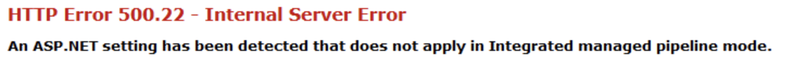

# Instrument an ASP.NET application deployed on IIS

## Setup

Use the `OpenTelemetry.DotNet.Auto.psm1` PowerShell module
to set up automatic instrumentation for IIS:

```powershell
# Import the module
Import-Module "OpenTelemetry.DotNet.Auto.psm1"

# Install core files
Install-OpenTelemetryCore

# Setup IIS instrumentation
Register-OpenTelemetryForIIS
```

> **Warning**
> `Register-OpenTelemetryForIIS` performs IIS restart.

### Add TelemetryHttpModule ASP.NET HTTP module

> **Note**
> This is NOT required for ASP.NET Core deployments.

This step is necessary only for ASP.NET (.NET Framework).

> **Note**
> There are three distinct options.

Add `OpenTelemetry.Instrumentation.AspNet.TelemetryHttpModule, OpenTelemetry.Instrumentation.AspNet.TelemetryHttpModule`
by modifying and extending `web.config` (first two options)
or `applicationHost.config` (third option).

```xml
  <system.web>
    <httpModules>
      <add name="TelemetryHttpModule" type="OpenTelemetry.Instrumentation.AspNet.TelemetryHttpModule, OpenTelemetry.Instrumentation.AspNet.TelemetryHttpModule" />
    </httpModules>
  </system.web>
```

> **Warning**
> After applying above changes you might experience following error as this configuration
> requires IIS classic mode.
> In order to fix it you can switch to classic mode or use other options. .

```xml
  <system.webServer>
    <validation validateIntegratedModeConfiguration="false" />
    <modules>
      <remove name="TelemetryHttpModule" />
      <add name="TelemetryHttpModule" type="OpenTelemetry.Instrumentation.AspNet.TelemetryHttpModule, OpenTelemetry.Instrumentation.AspNet.TelemetryHttpModule" preCondition="managedHandler" />
    </modules>
  </system.webServer>
```

> **Note** `applicationHost.config` is located in `%SystemDrive%\Windows\system32\inetsrv\config`.
> Below is an example where you can add the module
> to set it for all ASP.NET application running in Integrated Pipeline Mode:

```xml
  <location path="" overrideMode="Allow">
    <system.webServer>
      <modules>
        <add name="TelemetryHttpModule" type="OpenTelemetry.Instrumentation.AspNet.TelemetryHttpModule, OpenTelemetry.Instrumentation.AspNet.TelemetryHttpModule" preCondition="managedHandler" />
      </modules>
    </system.webServer>
  </location>
```

> **Note** After applying above changes you can check whether `opentelemetry modules`
> are loaded by using `appcmd` command.
> Following example shows invocation for `WebDemo\` application:

```terminal
  appcmd list modules /app.name:"WebDemo/"
```

and correct result:

```terminal
  MODULE "TelemetryHttpModule" ( type:OpenTelemetry.Instrumentation.AspNet.TelemetryHttpModule, OpenTelemetry.Instrumentation.AspNet.TelemetryHttpModule, preCondition:managedHandler )
```

## Configuration

> **Note**
> Remember to restart IIS after making configuration changes.
> You can do it by executing `iisreset.exe`.

For ASP.NET application you can configure the most common `OTEL_` settings
(like `OTEL_SERVICE_NAME`) via `appSettings` in `Web.config`.

If a service name is not explicitly configured, one will be generated for you.
If the application is hosted on IIS in .NET Framework this will use
`SiteName\VirtualDirectoryPath` ex: `MySite\MyApp`

For ASP.NET Core application you can use
the [`<environmentVariable>`](https://docs.microsoft.com/en-us/aspnet/core/host-and-deploy/iis/web-config#set-environment-variables)
elements inside the `<aspNetCore>` block of your `Web.config` file
to set configuration via environment variables.

### Advanced configuration

You can add the [`<environmentVariables>`](https://docs.microsoft.com/en-us/iis/configuration/system.applicationhost/applicationpools/add/environmentvariables/)
in `applicationHost.config`
to set environment variables for given application pools.

> For IIS versions older than 10.0, you can consider creating a distinct user,
  set its environment variables
  and use it as the application pool user.

Consider setting common environment variables,
for all applications deployed to IIS
by setting the environment variables for
`W3SVC` and `WAS` Windows Services as described in [windows-service-instrumentation.md](windows-service-instrumentation.md).
