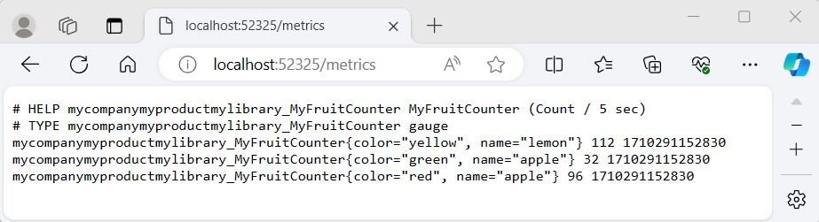
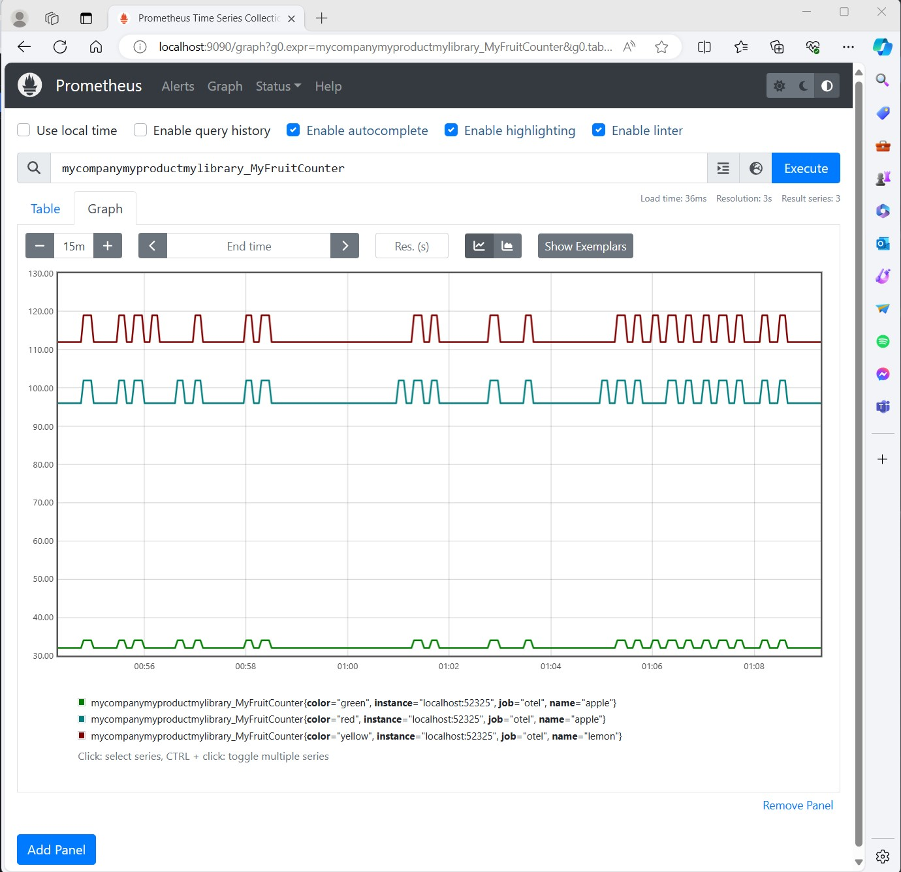
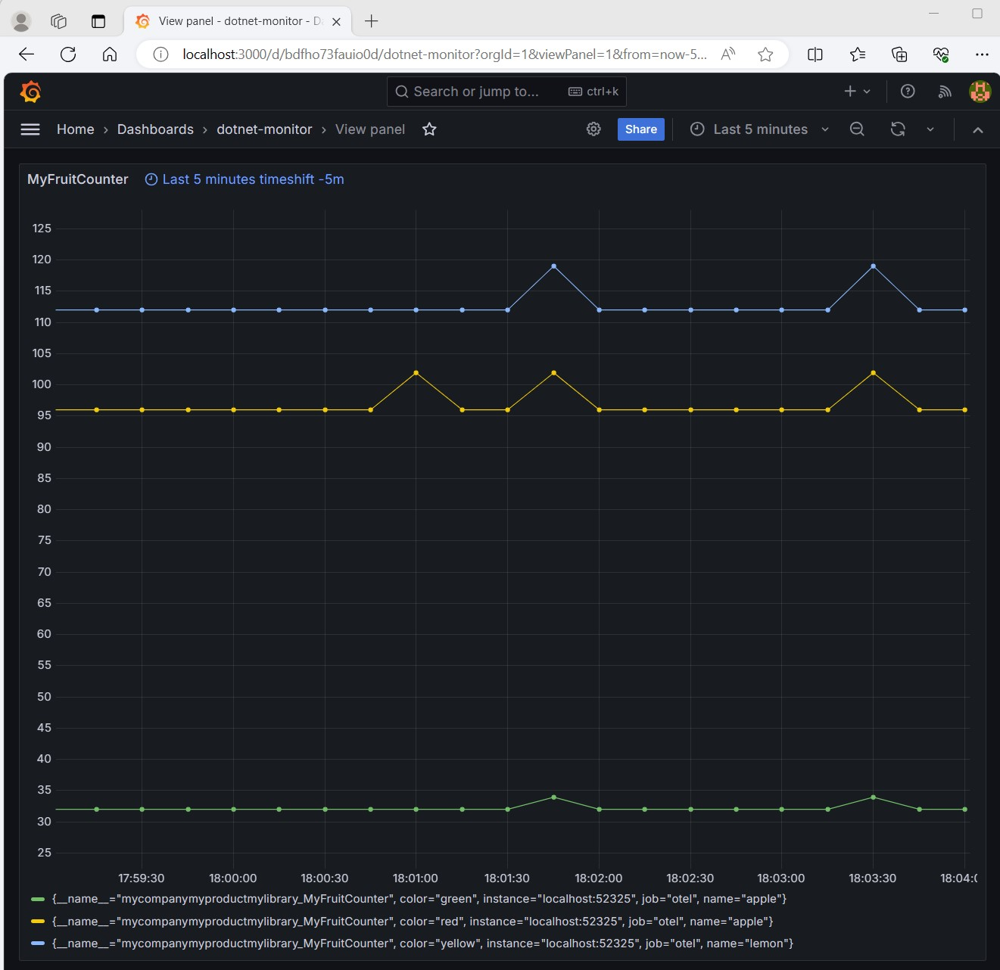

# Getting Started with dotnet-monitor, Prometheus and Grafana

- [Produce metrics from the application](#produce-metrics-from-the-application)
- [Collect metrics using dotnet-monitor](#collect-metrics-using-dotnet-monitor)
  - [Configuration](#configuration)
  - [Running dotnet-monitor](#running-dotnet-monitor)
  - [Access and validate the metrics](#access-and-validate-the-metrics)
- [Collect metrics using Prometheus](#collect-metrics-using-prometheus)
  - [Prometheus Configuration](#prometheus-configuration)
  - [Start Prometheus](#start-prometheus)
  - [View results in Prometheus](#view-results-in-prometheus)  
- [Explore metrics using Grafana](#explore-metrics-using-grafana)

## Produce metrics from the application

Create a new console application and run it:

```sh
dotnet new console --output getting-started-dotnet-monitor-metrics
cd getting-started-dotnet-monitor-metrics
dotnet run
```

Now copy the code from [Program.cs](./Program.cs) and run the application again.

For our learning purpose, use a while-loop to keep increasing the counter value
until any key is pressed.

```csharp
Console.WriteLine("Press any key to exit");
while (!Console.KeyAvailable)
{
    Thread.Sleep(1000);
    MyFruitCounter.Add(1, new("name", "apple"), new("color", "red"));
    MyFruitCounter.Add(2, new("name", "lemon"), new("color", "yellow"));
    MyFruitCounter.Add(1, new("name", "lemon"), new("color", "yellow"));
    ...
    ...
    ...
}
```

## Collect metrics using dotnet-monitor

Follow the [install
steps](https://learn.microsoft.com/en-us/dotnet/core/diagnostics/dotnet-monitor#install)
to download the dotnet-monitor.

### Configuration

1. **Configure dotnet-monitor API key**: To secure access to the dotnet-monitor
endpoints, you can set up an API key authentication by following the steps
outlined in [Configuring API Key
Authentication](https://github.com/dotnet/dotnet-monitor/blob/main/documentation/api-key-setup.md#configuring-api-key-authentication).
If your use case is limited to a test environment, you might opt to bypass API
key configuration by using the `--no-auth` switch when running dotnet-monitor.
Learn more about dotnet-monitor authentication
[here](https://github.com/dotnet/dotnet-monitor/blob/1beca4d497da1e60985394fe7d1195c0663f7095/documentation/authentication.md?plain=1#L115).

2. **Set a default process and customize metrics collection**: To monitor a
   specific local process and capture custom metrics, use a settings.json file.
   This file defines both the default process to monitor and the specific meters
   to collect metrics. For instance, to monitor a
   `getting-started-dotnet-monitor-metrics` process and collect metrics from the
   "MyCompany.MyProduct.MyLibrary" meter, create a settings.json file with the
   following content:

```json
{
    "$schema": "https://aka.ms/dotnet-monitor-schema",
    "DefaultProcess": {
        "Filters": [{
            "Key": "ProcessName",
            "Value": "getting-started-dotnet-monitor-metrics"
        }]
    },
    "Metrics": {
        "Meters": [
            {
                "MeterName": "MyCompany.MyProduct.MyLibrary"
            }
        ]
    }
}
```

When starting dotnet-monitor, specify the path to this settings.json file using
the `--configuration-file-path` switch.

### Running dotnet-monitor

Run dotnet-monitor in a command prompt or terminal. If you have configured an
API key, ensure to use it. If you are running in a test environment and prefer
not to use authentication, you can start dotnet-monitor with the `--no-auth`
switch:

```bash
dotnet-monitor collect --no-auth --configuration-file-path path/to/settings.json
```

Or, if you have set up an API key:

```bash
dotnet-monitor collect --configuration-file-path path/to/settings.json
```

This command starts the collection process. By default, dotnet-monitor listens
on [http://localhost:52325/](http://localhost:52325/).

### Access and validate the metrics

Access the metrics endpoint. Once dotnet-monitor is running, you can access the
metrics endpoint using a web browser or a tool like curl. The default URL for
metrics is [http://localhost:52325/metrics](http://localhost:52325/metrics). If
you are using authentication, include the API key in your request header. For
example, using curl with an API key:

```bash
curl -H "Authorization: Bearer <Your-API-Key>" http://localhost:52325/metrics
```

Without authentication (in test environments):

```bash
curl http://localhost:52325/metrics
```



Now, we understand how we can configure dotnet-monitor to collect metrics. Next,
we are going to learn about how to use Prometheus to capture metrics from
dotnet-monitor.

## Collect metrics using Prometheus

Follow the [first steps](https://prometheus.io/docs/introduction/first_steps/)
to download the [latest release](https://prometheus.io/download/) of Prometheus.

### Prometheus Configuration

After finished downloading, extract it to a local location that's easy to
access. We will find the default Prometheus configuration YAML file in the
folder, named `prometheus.yml`.

Let's create a new file in the same location as where `prometheus.yml` locates,
and named the new file as `otel.yml` for this exercise. Then, copy and paste the
entire content below into the `otel.yml` file we have created just now.

```yaml
global:
  scrape_interval: 10s
  evaluation_interval: 10s
scrape_configs:
  - job_name: "otel"
    static_configs:
      - targets: ["localhost:52325"]
```

### Start Prometheus

Follow the instructions from
[starting-prometheus](https://prometheus.io/docs/introduction/first_steps/#starting-prometheus)
to start the Prometheus server and verify it has been started successfully.

Please note that we will need pass in `otel.yml` file as the argument:

```console
./prometheus --config.file=otel.yml
```

### View results in Prometheus

To use the graphical interface for viewing our metrics with Prometheus, navigate
to [http://localhost:9090/graph](http://localhost:9090/graph), and type
`mycompanymyproductmylibrary_MyFruitCounter` in the expression bar of the UI;
finally, click the execute button.

We should be able to see the following chart from the browser:



From the legend, we can see that the `instance` name and the `job` name are the
values we have set in `otel.yml`.

Congratulations!

Now we know how to configure Prometheus server and collect our metrics using
dotnet-monitor. Next, we are going to explore a tool called Grafana, which has
powerful visualizations for the metrics.

### Explore metrics using Grafana

[Install Grafana](https://grafana.com/docs/grafana/latest/setup-grafana/installation/).

Start the standalone Grafana server (`grafana-server.exe` or
`./bin/grafana-server`, depending on the operating system). Then, use the
browser to navigate to [http://localhost:3000/](http://localhost:3000/).

Follow the instructions in the Grafana getting started
[doc](https://grafana.com/docs/grafana/latest/fundamentals/getting-started/first-dashboards/#sign-in-to-grafana)
to log in.

After successfully logging in, click on the explore option on the left panel of
the website - we should be able to write some queries to explore our metrics
now!

Feel free to find some handy PromQL
[here](https://promlabs.com/promql-cheat-sheet/).

In the below example, the query targets to find out what is the per-second rate
of increase of myFruitCounter over the past 5 minutes:



## Learn more

- [What is Prometheus?](https://prometheus.io/docs/introduction/overview/)
- [Using Prometheus as your OpenTelemetry backend](https://prometheus.io/docs/guides/opentelemetry/)
- [Grafana support for
  Prometheus](https://prometheus.io/docs/visualization/grafana/#creating-a-prometheus-graph)
